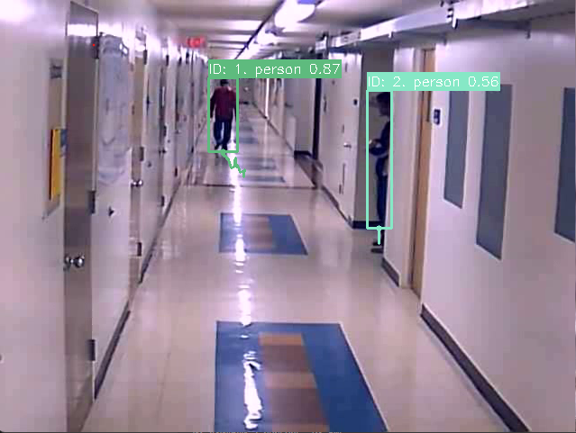
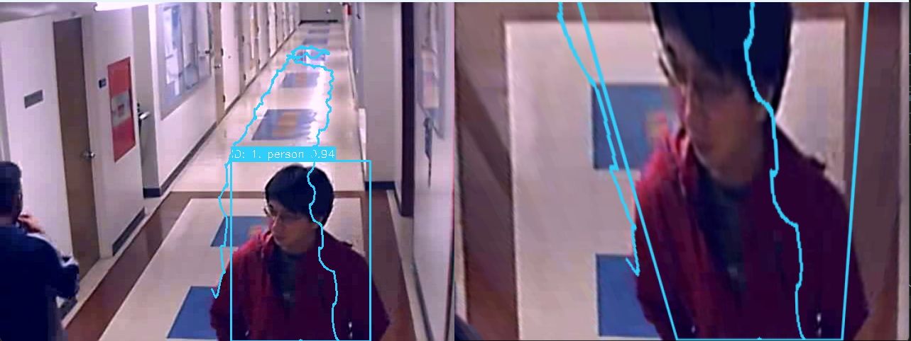
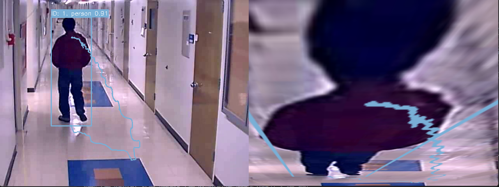
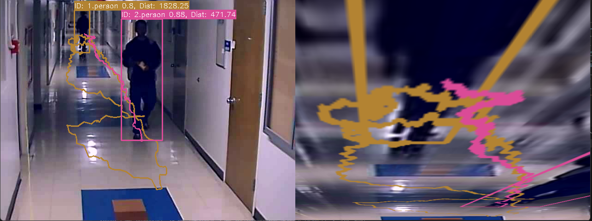

# Yolov8Detector

Задача: Необходимо реализовать трэкер людей с отображением пройденного пути на кадре длиной N пикселей. За опорную точку взять нижнюю среднюю точку bounding box. 
Дополнительно: сделать отображение пути сверху, bird-eye view. Использовать для этого матрицу гомографии.
Датасет: http://www.santhoshsunderrajan.com/datasets.html#hfh_tracking Hallway Corridor - Multiple Camera Tracking..

После предварительного анализа поставленной задачи было выявлено два основных способа решения:
1. Использование уже готовой архитектуры НС, направленной на выполнение задачи детектирования, и создание собственной оболочки вокруг готовой архитектуры
2. Разработка собственной архитектуры НС, самостоятельная разметка предоставленного набора данных, обучение НС, и создание оболочки вокруг разработанной архитектуры

Принято решение, с целью экономии ресурсов, выполнить посталенную задачу первым методом. Для решения поставленной задачи была выбрана новейшая архитектура YOLOv8 [https://docs.ultralytics.com/].

Результат работы NN представлен на рисунке 1:

Рисунок 1. Результат работы нейронной сети

Для выполнения дополнительной задачи для каждого видеоролика была повторно расчитана матрица гомографии (В зависимости от видеоролика положение камеры может отличаться). Расчет выполнялся с помощью встроенных в библиотеку OpenCV функций.
Результат работы для видео 3 представлен на рисунке 2:

Рисунок 2. Результат работы алгоритма

Результат работы для видео 5 представлен на рисунке 3:

Рисунок 3. Результат работы алгоритма

Для выбора видеоролика необхдимо изменить параметр "self.video_id"

Дополнительно в версии "YoloTracker_Distance.py" отображается дистанция, пройденная объектом, в пикселях, как показано на риснуке 4:

Рисунок 4. Результат работы алгоритма "YoloTracker_Distance.py" на видео 5

